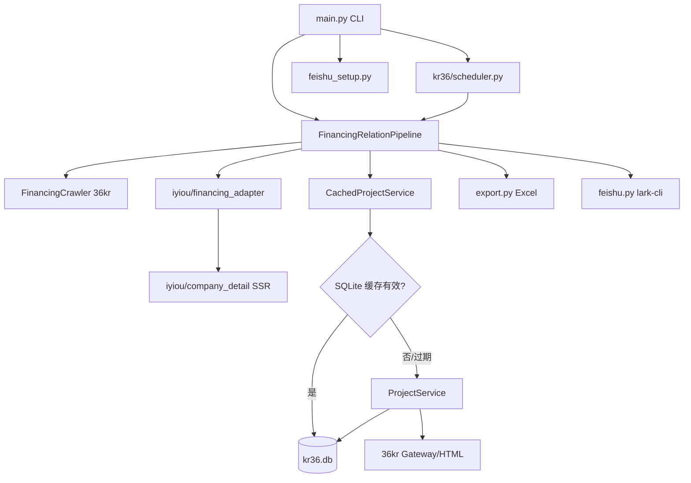
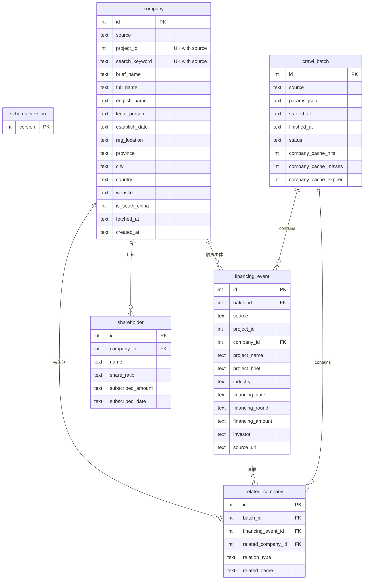

# 36Ke 融资关联公司拉取 — 技术方案

> 依据需求文档《融资关联公司拉取》实现。数据源：**36氪 PitchHub + 亿欧投资事件**；公司详情 **SQLite 缓存 30 天**；支持 **每日定时拉取** 与 **Windows 绿色包分发**。

当前数据库 Schema 版本：**v3**（`schema_version` 表）。

---

## 1. 需求概述

| 编号 | 需求 | 实现 |
|------|------|------|
| R1 | 拉取 36氪融资公司列表 | `FinancingCrawler` → Gateway `project/financing/list` |
| R2 | 拉取亿欧投资事件首页 | `fetch_iyiou_financing_list`（Playwright + `defaultList` API） |
| R2b | 亿欧企业详情补充 | `company_detail.py` 访问 `/profile` + `/reginfo` SSR |
| R3 | 获取公司详情（工商、股东） | `ProjectService` → 36kr Gateway/HTML |
| R4 | 公司详情缓存 30 天 | `CachedProjectService` + `company.fetched_at` |
| R5 | 华南关联筛选 | `is_south_china_region` + 股东穿透（仅 36kr） |
| R6 | 导出 Excel 表1（融资列表） | PDF 2.4 字段 + **数据来源**列 |
| R7 | 导出 Excel 表2（华南关联） | 同融资公司多行合并首列 |
| R8 | 飞书推送 | `FeishuNotifier` + `lark-cli`；`setup-feishu` 一键安装 |
| R9 | 融资事件跨批次去重 | `UNIQUE(project_name, financing_date)` + UPSERT |
| R10 | 亿欧投资方字段清洗 | `format_iyiou_investors` 提取 `investorName` 纯文本 |
| R11 | 每日定时拉取 | `schedule` 命令，约 9:00 ±15 分钟（按日随机） |

---

## 2. 整体架构



---

## 3. 服务设计

### 3.1 模块职责

| 模块 | 职责 |
|------|------|
| `kr36/financing.py` | 36氪融资列表分页拉取 |
| `kr36/project.py` | 36kr 公司搜索、详情解析（工商/股东/官网） |
| `kr36/services/cached_project.py` | 缓存门面：先查库，未命中或过期再调 API |
| `kr36/pipeline.py` | 主编排：拉取 → 详情 → 华南筛选 → 入库 → 导出 |
| `kr36/db/` | SQLite schema（v3）、连接、迁移、Repository |
| `kr36/export.py` | 表1 融资列表 + 表2 华南关联 Excel |
| `kr36/feishu.py` / `feishu_setup.py` | 飞书推送 / lark-cli 安装授权 |
| `kr36/region.py` | cpca 地址解析 + 华南省份判定 |
| `kr36/scheduler.py` | 每日定时调度（随机时刻） |
| `kr36/paths.py` | 程序根目录、默认 data/db 路径（兼容 PyInstaller） |
| `kr36/iyiou/*` | 亿欧 Playwright 数据源、详情补充、investor 清洗 |
| `packaging/` | Windows 完整版 PyInstaller 打包（内置 Chromium） |

### 3.2 数据源与合并

| source | 融资列表 | 公司详情 | 股东穿透 |
|--------|----------|----------|----------|
| `36kr` | Gateway API | 36kr API/HTML + 缓存 | 支持 |
| `iyiou` | Playwright + `defaultList` | 亿欧详情页 SSR | 不支持 |
| `all` | 两源合并 | 按 `source` 分流 | 仅 36kr 条目 |

**合并规则**（`--source all`）：

- 去重键：`(project_name, financing_date)`
- **36kr 优先**：同名同日期仅保留 36kr 记录
- 亿欧单条失败（详情页超时等）不影响列表入库，跳过该条详情补充

### 3.3 CachedProjectService 缓存策略

```
get_detail(project_id):
  1. SELECT company WHERE source='36kr' AND project_id=?
  2. IF 存在 AND fetched_at + TTL > now → hits++，返回 row_to_detail
  3. IF 存在 BUT 过期 → expired++，重新拉取
  4. IF 不存在 → misses++，拉取并 UPSERT
  5. 刷新 shareholder 子表（先删后插）

get_detail_by_name(keyword):
  缓存键 search_keyword，逻辑同上
```

配置：`Settings.db_path`（默认 `data/kr36.db`）、`Settings.cache_ttl_days`（默认 30）。

> 说明：`company` 表当前写入来源均为 `36kr`（含亿欧融资公司的详情快照，project_id 为亿欧侧哈希 ID）。亿欧详情由 `IyiouCompanyDetail` 解析后直接映射为 `ProjectDetail` 入库。

### 3.4 Pipeline 主流程

1. 创建 `crawl_batch` 记录
2. 按 `--source` 拉取融资列表；亿欧源同事务内补充详情页
3. 对每条融资事件：
   - `_resolve_detail()`：36kr 走缓存/API；亿欧走 `_iyiou_details` 或列表字段
   - 有详情则 `company` UPSERT + `shareholder` 刷新
   - `financing_event` UPSERT（全局去重）
   - 华南判定 → 写入 `related_company`（`self` / `shareholder`）
4. 导出 Excel 表1、表2
5. 更新 batch 缓存统计；可选飞书推送

### 3.5 华南判定规则

- 注册地址经 `cpca` 解析，省份 ∈ {广东、广西、福建、海南}，或 adcode 前缀 ∈ {44, 45, 35, 46}
- **或**融资列表/详情中的省份字段 ∈ 华南（如亿欧 `provinceDesc`）
- 融资公司本身在华南 → 表2 `relation_type=self`（无需完整 36kr 详情）
- 股东穿透仅 **36kr** 源：过滤关键词后查股东注册地 → `relation_type=shareholder`

### 3.6 股东过滤规则

名称含以下关键词的股东跳过：`咨询、投资、管理、基金、股权`

### 3.7 亿欧详情补充

1. 列表 API 返回 `comId` → `source_url = https://data.iyiou.com/company/details/{comId}/profile`
2. 同 Playwright 会话内访问 `/profile`，读取 `__INITIAL_STATE__.companyDetailModule`
3. 缺注册地址/工商信息时访问 `/reginfo`，合并 `regInfo.regLocation`、`legalRepresent` 等
4. 投资方：`format_iyiou_investors()` 从 JSON 列表提取 `investorName`，顿号连接

### 3.8 定时任务

- 命令：`python main.py schedule [--hour 9] [--spread 30]`
- 每天在 `hour ± spread/2` 分钟范围内随机执行（按日期种子，同一天时刻固定）
- 日志：`data/schedule.log`
- 安装：`scripts/install_daily_schedule.sh`（macOS launchd）/ `.bat`（Windows 登录启动）

---

## 4. 数据表设计（SQLite）

### 4.1 ER 关系



### 4.2 表结构明细

#### schema_version

| 字段 | 类型 | 说明 |
|------|------|------|
| version | INTEGER PK | 当前 schema 版本（**3**） |

#### crawl_batch — 拉取批次

| 字段 | 类型 | 说明 |
|------|------|------|
| id | INTEGER PK | 自增批次 ID |
| source | TEXT | 固定 `36kr`（历史字段） |
| params_json | TEXT | 运行参数 JSON（days、source、pages 等） |
| started_at | TEXT | 开始时间 ISO8601 UTC |
| finished_at | TEXT | 结束时间 |
| status | TEXT | `running` / `completed` |
| company_cache_hits | INTEGER | 本次运行缓存命中数 |
| company_cache_misses | INTEGER | 本次新拉取数 |
| company_cache_expired | INTEGER | 本次过期刷新数 |

#### company — 公司详情缓存

| 字段 | 类型 | 说明 |
|------|------|------|
| id | INTEGER PK | 自增 |
| source | TEXT | 默认 `36kr` |
| project_id | INTEGER | 36kr 项目 ID 或亿欧哈希 ID；与 source 联合唯一 |
| search_keyword | TEXT | 股东名称搜索缓存键；与 source 联合唯一 |
| brief_name | TEXT | 企业简称 |
| full_name | TEXT | 企业全称（工商名） |
| english_name | TEXT | 英文全称 |
| legal_person | TEXT | 法定代表人 |
| establish_date | TEXT | 成立日期 |
| reg_location | TEXT | 注册地址 |
| province | TEXT | 省份 |
| city | TEXT | 城市 |
| country | TEXT | 国家 |
| website | TEXT | 官网 |
| is_south_china | INTEGER | 0/1，是否华南 |
| fetched_at | TEXT | **详情最后拉取时间**（TTL 判定依据） |
| created_at | TEXT | 记录首次入库时间 |

**索引：**

- `idx_company_fetched_at (fetched_at)`
- `idx_company_project_id (project_id)`

**约束：**

- `UNIQUE (source, project_id)`
- `UNIQUE (source, search_keyword)`

**设计说明（v3）：**

- 已移除 `raw_json`：详情字段全部展开到列 + `shareholder` 子表
- 已移除 `updated_at`：与 `fetched_at` 语义重复；更新时仅刷新 `fetched_at`，保留 `created_at`

#### shareholder — 股东明细

| 字段 | 类型 | 说明 |
|------|------|------|
| id | INTEGER PK | 自增 |
| company_id | INTEGER FK | → `company.id`，ON DELETE CASCADE |
| name | TEXT | 股东名称 |
| share_ratio | TEXT | 持股比例 |
| subscribed_amount | TEXT | 认缴出资 |
| subscribed_date | TEXT | 认缴日期 |

**约束：** `UNIQUE (company_id, name)`  
**维护策略：** 每次 `save_detail` 先 DELETE 再 INSERT。

#### financing_event — 融资事件

| 字段 | 类型 | 说明 |
|------|------|------|
| id | INTEGER PK | 自增 |
| batch_id | INTEGER FK | → `crawl_batch.id` |
| source | TEXT | `36kr` / `iyiou` |
| project_id | INTEGER | 源侧项目/事件 ID |
| company_id | INTEGER FK | → `company.id`，可空 |
| project_name | TEXT | 企业简称 |
| project_brief | TEXT | 简介 |
| industry | TEXT | 行业（顿号连接） |
| financing_date | TEXT | 融资日期 `YYYY-MM-DD`，空串表示未知 |
| financing_round | TEXT | 融资轮次 |
| financing_amount | TEXT | 融资金额 |
| investor | TEXT | 投资方（亿欧已清洗为纯文本） |
| source_url | TEXT | 详情页 URL（36kr project / 亿欧 profile） |

**约束：** `UNIQUE (project_name, financing_date)` — 跨 batch 全局去重

**索引：**

- `idx_financing_event_project (project_id)`
- `idx_financing_event_name_date (project_name, financing_date)`

**写入逻辑：** `save_event()` 按 `(project_name, financing_date)` 查找，存在则 UPDATE 并复用 id。

#### related_company — 华南关联结果

| 字段 | 类型 | 说明 |
|------|------|------|
| id | INTEGER PK | 自增 |
| batch_id | INTEGER FK | → `crawl_batch.id` |
| financing_event_id | INTEGER FK | → `financing_event.id` |
| related_company_id | INTEGER FK | → `company.id`（可为占位记录） |
| relation_type | TEXT | `self` / `shareholder` |
| related_name | TEXT | 关联公司名称 |

**约束：** `UNIQUE (financing_event_id, related_company_id, relation_type)`

| relation_type | 含义 |
|---------------|------|
| `self` | 融资公司本身在华南 |
| `shareholder` | 股东公司在华南 |

### 4.3 Schema 迁移历史

| 版本 | 变更 |
|------|------|
| v1 | 初始表结构；`financing_event` 按 `(batch_id, project_id)` 唯一 |
| v2 | `financing_event` 改为 `UNIQUE(project_name, financing_date)`，合并历史重复 |
| v3 | `company` 移除 `raw_json`、`updated_at`；详情字段列式存储 |

迁移入口：`init_db()` → `kr36/db/connection.py::_migrate()`。

---

## 5. 对外接口（CLI）

```bash
# 手动拉取
python main.py --days 7                          # 36kr，最近 7 天
python main.py --source all --days 3             # 36kr + 亿欧
python main.py --source all --days 3 --no-push-feishu

# 飞书
python main.py setup-feishu                      # 安装 lark-cli + 授权

# 定时任务
python main.py schedule --source all --days 3    # 前台守护，约 9:00 ±15min
python main.py schedule --dry-run                # 查看下次执行时间

# 安装系统定时
bash scripts/install_daily_schedule.sh           # macOS
scripts\install_daily_schedule.bat               # Windows
```

路径说明：打包后 `data/`、`kr36.db` 相对于 **exe 所在目录**（`kr36/paths.py`）。

---

## 6. Excel 输出

### 表1：融资公司列表

| 列名 | 来源 |
|------|------|
| 数据来源 | `36氪` / `亿欧` |
| 企业简称、企业全称、简介 | 融资列表 + 详情合并 |
| 融资轮次、融资时间、融资金额、投资方 | 融资列表 |
| 行业 | 融资列表 |
| 注册地址、省份、国家 | 详情优先，列表兜底 |

### 表2：华南关联公司

融资公司、融资日期、融资金额、融资轮次、华南关联公司（同公司多行合并首列）

---

## 7. 依赖与环境

| 依赖 | 用途 |
|------|------|
| Python 3.11+ | 运行时 |
| requests、pandas、openpyxl、typer、cpca | 核心 |
| Playwright + Chromium | `--source iyiou\|all` |
| lark-cli（Node.js） | 飞书推送（可选） |

Windows 分发：`packaging/build_full.bat` → `dist/36Ke/` 绿色包（内置 Chromium）。

---

## 8. 后续扩展

- 企查查/天眼查 API 作为 36kr 详情 fallback
- 亿欧源股东穿透（若详情页/API 可获取股东）
- 控股/对外投资穿透（需商业 API）
